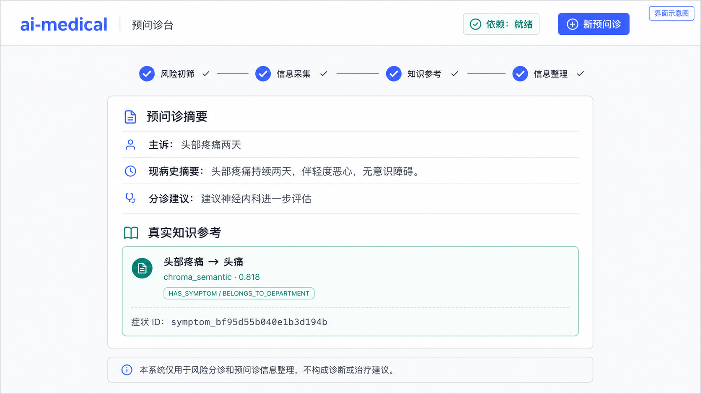

# ai-medical

`ai-medical` 是一个基于 LangGraph 的多 Agent 医疗预问诊系统。它接收患者的症状描述，先执行确定性风险初筛，再通过多轮问答收集信息；需要医学知识辅助时，系统会只读查询 MySQL、Chroma 和 Neo4j，最后生成结构化预问诊摘要与病历草稿。

系统只用于风险分诊、就诊科室建议和预问诊信息整理，不提供疾病诊断、处方或替代医生的治疗建议。命中严重胸痛、意识障碍、突发神经症状、大出血、严重呼吸困难等红旗规则时，流程会立即停止普通问诊并提示线下急救或急诊评估。

## 核心能力

- 确定性红旗症状检查优先于大模型判断，大模型不能覆盖已经命中的高危规则。
- 使用 LangGraph 管理分诊、预问诊、知识检索、摘要和紧急结束等节点。
- 使用同一个 `session_id` 保存和恢复多轮状态，不会在每次 HTTP 请求时重新开始问诊。
- 预问诊每轮只提出一个主要问题，并保留患者明确肯定、否定和尚未提供的信息。
- 通过 MySQL 实体映射、Chroma 语义召回和 Neo4j 图谱查询生成可追溯的 `GraphEvidence`。
- 摘要和病历草稿只整理患者已经提供的事实，不把图谱关联疾病写成患者诊断。
- React 单页前端展示等待回答、完成、紧急结束和失败四种状态。
- 提供受配置控制的安全只读 trace，用于展示检索意图、标准化方式、图谱关系、稳定 ID 和来源记录。

## 结果展示示例

下图展示一次预问诊完成后的页面结构，包括问诊进度、结构化摘要、实体标准化方式、Neo4j 关系和可追溯稳定 ID。

> 图片为界面示意图，用于说明前端展示效果，不替代真实 API、数据库集成测试或当前运行环境的验收结果。



## 系统流程

```text
患者输入
  ↓
会话初始化或恢复
  ↓
风险分诊
  ├─ 命中红旗规则 → emergency_ended → 提示立即线下评估并锁定会话
  └─ 未命中红旗规则
       ↓
多轮预问诊信息采集
  ├─ 信息不足 → waiting_user → 等待同一 session_id 的下一条回答
  ├─ 需要知识辅助
  │    ↓
  │  MySQL 精确标准化
  │    └─ 未命中时使用本地 BGE 查询 Chroma
  │         ↓
  │       Neo4j 参数化白名单查询
  │         ↓
  │       GraphEvidence 写入 LangGraph 状态
  └─ 信息充分或达到最大轮数
       ↓
结构化摘要和病历草稿
  ↓
completed
```

主要会话状态：

| 状态 | 含义 |
| --- | --- |
| `triaging` | 正在执行风险分诊 |
| `preconsulting` | 正在提取和整理预问诊信息 |
| `waiting_user` | 本轮已结束，等待患者回答 |
| `summarizing` | 正在整理摘要 |
| `completed` | 正常完成预问诊 |
| `emergency_ended` | 因高危风险提前结束 |
| `failed` | 外部依赖或内部状态导致流程无法安全继续 |

## 技术栈

- Python 3.11 或 3.12
- FastAPI、Pydantic
- LangGraph、LangChain
- MySQL：实体同义词和标准词映射
- Chroma：医学实体向量索引
- Neo4j：疾病、症状、科室和检查等知识图谱
- 本地 `bge-base-zh-v1.5`：实体向量和查询向量
- React、TypeScript、Vite

## 目录结构

```text
ai-medical/
├─ src/
│  ├─ agents/       # 分诊、预问诊和摘要 Agent
│  ├─ api/          # FastAPI 路由与 HTTP 模型
│  ├─ config/       # 环境配置
│  ├─ datasync/     # 离线清洗、实体对齐、图谱与向量产物构建
│  ├─ graph/        # LangGraph 状态、路由与工作流
│  ├─ models/       # 在线领域模型
│  ├─ services/     # 数据库、LLM 和会话服务
│  └─ tools/        # 红旗规则、实体标准化和图谱检索
├─ scripts/
│  ├─ prepare_data.py          # 数据整理；默认 dry-run
│  ├─ init_databases.py        # 数据库对象只读规划或受控初始化
│  └─ verify_database_data.py  # 按稳定 ID 只读验证真实数据
├─ db/               # 供审阅的 MySQL 与 Neo4j 结构定义
├─ data/
│  ├─ knowledge_graph/ # 只读原始医学 JSONL
│  ├─ processed/       # 标准化数据产物及 manifest
│  └─ vectorstore/     # 本地 Chroma 持久化目录
└─ frontend/         # React 单页前端
```

## 数据契约

离线数据流水线从只读原始 JSONL 生成以下文件：

| 产物 | 内容 |
| --- | --- |
| `cleaned_medical_records.jsonl` | 清洗并校验后的疾病记录 |
| `entity_mapping.jsonl` | 原始词、标准词、实体类型、稳定 ID、方法和置信度 |
| `graph_nodes.jsonl` | 可导入 Neo4j 的标准节点 |
| `graph_relations.jsonl` | 可导入 Neo4j 的标准关系 |
| `vector_documents.jsonl` | 可写入 Chroma 的文本、稳定 ID 和 metadata |
| `rejected_records.jsonl` | 无法通过校验的来源行和拒绝原因 |
| `manifest.json` | 输入摘要、参数、模型信息、统计和各产物 SHA256 |

实体类型固定为：`disease`、`symptom`、`department`、`check`、`drug`、`food`、`cause`、`people`。

Neo4j 节点标签分别为 `Disease`、`Symptom`、`Department`、`Check`、`Drug`、`Food`、`Cause` 和 `People`。主要关系均从疾病指向目标实体：

- `Disease -[:HAS_SYMPTOM]-> Symptom`
- `Disease -[:BELONGS_TO_DEPARTMENT]-> Department`
- `Disease -[:RECOMMENDS_CHECK]-> Check`
- `Disease -[:COMMON_DRUG]-> Drug`
- `Disease -[:RECOMMENDS_FOOD]-> Food`
- `Disease -[:AVOIDS_FOOD]-> Food`
- `Disease -[:HAS_CAUSE]-> Cause`
- `Disease -[:AFFECTS_PEOPLE]-> People`

Chroma collection 固定为 `ai_medical`。文档 ID 与对应图节点稳定 ID 相同，metadata 包含 `entity_type`、Neo4j `label`、固定来源 `ai-medical:t2` 和关联实体 ID；其中 `ai-medical:t2` 是为兼容现有数据保留的来源标识，不要求读者了解它原先对应的开发阶段名称。

稳定 ID 由实体类型和规范化文本的 SHA-256 摘要确定。同一输入和配置重复构建时，除 manifest 生成时间外，核心产物和 ID 保持不变。

## 数据库职责与安全边界

- MySQL 表 `entity_mapping` 保存同义词到标准实体的映射。在线请求只执行参数化 `SELECT`。
- Chroma collection `ai_medical` 保存标准实体向量。在线请求只执行向量查询。
- Neo4j 保存医学知识图谱。在线请求只执行代码内定义的参数化白名单 Cypher，不接受大模型生成的任意 Cypher。
- FastAPI 启动和患者请求不会自动清洗数据、初始化数据库或导入数据。
- 数据库或索引不可用时，RAG 请求会明确失败，不会把故障伪装为“没有检索结果”，也不会生成伪造证据。
- 禁止清库、删表、删约束、删除图数据、全库重建或清空 Chroma collection。
- 初始化和导入仅允许 `CREATE ... IF NOT EXISTS`、受约束 upsert、Neo4j `MERGE` 和 Chroma 稳定 ID upsert。
- 任何真实初始化、DDL、数据库写入或 `--apply` 都必须先只读检查、确认影响范围并取得明确授权。

## 环境要求

本项目的所有 Python、pip 和 uvicorn 命令只能在已有 Conda `graph` 环境中执行。不要使用 Conda `base`、系统 Python、用户级 Python或另建虚拟环境。

```powershell
conda info --envs
conda run -n graph python --version
conda run -n graph python -c "import sys; print(sys.executable)"
```

安装 Python 依赖：

```powershell
conda run -n graph python -m pip install -r requirements.txt
```

前端命令只在 `frontend/` 中运行，并使用 `package-lock.json`：

```powershell
cd frontend
npm ci
```

### 下载本地向量模型

项目默认从 `pretrained/bge-base-zh-v1.5` 离线加载
[`BAAI/bge-base-zh-v1.5`](https://huggingface.co/BAAI/bge-base-zh-v1.5)。模型文件约
390 MB，不纳入 Git 仓库；首次运行数据流水线或启用 RAG 前，需要在项目根目录下载：

```powershell
conda run -n graph hf download BAAI/bge-base-zh-v1.5 --local-dir pretrained/bge-base-zh-v1.5
```

下载后确认模型目录存在：

```powershell
Get-ChildItem pretrained/bge-base-zh-v1.5
```

代码使用 `local_files_only=True`，运行时不会自动从网络补下载模型。如果模型放在其他目录，执行数据准备时使用
`--embedding-model` 指定路径，在线服务则在 `.env` 中设置 `EMBEDDING_MODEL_PATH`。

## 配置

将 `.env.example` 复制为 `.env`，只在本机填写真实凭据。`.env`、密码和 API Key 不得提交。

```powershell
Copy-Item .env.example .env
```

主要配置：

| 配置项 | 用途 | 常用值 |
| --- | --- | --- |
| `MYSQL_HOST`、`MYSQL_PORT` | MySQL 地址 | `localhost`、`3306` |
| `MYSQL_USER`、`MYSQL_PASSWORD` | MySQL 凭据 | 本地只读或初始化账号 |
| `MYSQL_DATABASE` | 项目数据库 | `ai_medical` |
| `NEO4J_URI` | Neo4j Bolt 地址 | `bolt://localhost:7687` |
| `NEO4J_USERNAME`、`NEO4J_PASSWORD` | Neo4j 凭据 | 本地账号 |
| `NEO4J_DATABASE` | 显式目标数据库 | `neo4j` |
| `CHROMA_DIR` | Chroma 持久化目录 | `data/vectorstore` |
| `CHROMA_COLLECTION` | 向量集合 | `ai_medical` |
| `EMBEDDING_MODEL_PATH` | 本地向量模型目录 | `pretrained/bge-base-zh-v1.5` |
| `EMBEDDING_DEVICE` | 向量模型运行设备 | `cpu` |
| `RAG_ENABLED` | 是否启用真实知识检索 | 正式运行使用 `true` |
| `LLM_ENABLED` | 是否调用大模型 | `false` 时使用规则和模板降级 |
| `LLM_PROVIDER`、`DEEPSEEK_MODEL` | 大模型提供方和模型名称 | `deepseek`、`deepseek-chat` |
| `DEEPSEEK_API_KEY` | DeepSeek 密钥 | 仅启用 LLM 时需要 |
| `CHECKPOINT_BACKEND` | 会话检查点后端 | 当前支持 `memory` |
| `MAX_QUESTION_COUNT` | 最大追问轮数 | 默认 `6` |
| `DEMO_TRACE_ENABLED` | 是否开放安全只读 trace | 默认 `false` |
| `DATASYNC_APPLY_ENABLED` | 是否允许离线写入适配器 | 默认必须为 `false` |

`GET /health` 只确认应用存活，不会加载数据库或 BGE。`GET /health/dependencies` 返回 `ready`、`not_initialized` 或 `unavailable`，页面打开本身不会主动初始化大型依赖。

`.env.example` 默认关闭 RAG 和 LLM，便于刚克隆仓库时先启动规则与模板降级模式。完成模型下载、数据准备和三库初始化后，
再将 `RAG_ENABLED` 改为 `true`；配置好 `DEEPSEEK_API_KEY` 后，可按需将 `LLM_ENABLED` 改为 `true`。

## 准备数据

原始医学数据、处理产物和本地 Chroma 索引均不纳入 Git 仓库。请先自行取得具有合法使用和再处理权限的医学数据，
并将 UTF-8 编码的 JSONL 文件放到：

```text
data/knowledge_graph/medical_kg.jsonl
```

JSONL 每行必须是一个 JSON 对象，`name` 是必填疾病名称；其余支持字段为 `desc`、`symptom`、
`department`、`check`、`drug`、`eat`、`not_eat`、`cause` 和 `people`。多值字段可以是字符串或字符串数组。例如：

```json
{"name":"示例疾病","desc":"仅用于说明数据格式","symptom":["示例症状"],"department":["示例科室"],"check":[],"drug":[],"eat":[],"not_eat":[],"cause":"","people":""}
```

先用少量记录进行快速校验，并把校验产物写到独立目录：

```powershell
conda run -n graph python scripts/prepare_data.py --limit 20 --output data/processed-smoke
```

确认输出统计和拒绝记录符合预期后，构建完整本地产物：

```powershell
conda run -n graph python scripts/prepare_data.py
```

默认输入、输出和模型路径分别是：

```text
data/knowledge_graph/medical_kg.jsonl
data/processed/
pretrained/bge-base-zh-v1.5/
```

如需使用其他路径，可以显式指定：

```powershell
conda run -n graph python scripts/prepare_data.py `
  --input D:/path/to/medical_kg.jsonl `
  --output data/processed `
  --embedding-model D:/path/to/bge-base-zh-v1.5
```

只验证清洗和契约、不加载向量模型时，可使用 `--no-embeddings`。该模式适合排查输入格式，不能用于正式数据库导入：

```powershell
conda run -n graph python scripts/prepare_data.py --no-embeddings --limit 20 --output data/processed-smoke
```

流水线顺序为：

```text
inspect → clean → align → build_graph → build_vectors → validate → export
```

正式产物必须满足：

- `manifest.json` 中 `parameters.limit` 为 `null`，不是抽样产物；
- 已启用本地 BGE 嵌入；
- 六类产物 SHA256 与 manifest 一致；
- 实体映射和向量 ID 都能对应图节点；
- 图关系不存在悬空端点；
- 相同输入重复运行的稳定 ID 和核心内容一致。

## 初始化、导入和验证真实数据库

先执行只读规划。该命令检查现有 MySQL、Neo4j 和 Chroma 对象并报告计划，不执行 DDL：

```powershell
conda run -n graph python scripts/init_databases.py
```

只有在审阅计划、备份现有服务并明确授权后，才允许初始化缺失对象：

```powershell
conda run -n graph python scripts/init_databases.py --apply --confirm-init
```

初始化只会幂等创建项目需要的库、表、索引、Neo4j 唯一约束和 Chroma collection。已有 collection 会被复用，不会被清空。

正式导入前，将本地 `.env` 中 `DATASYNC_APPLY_ENABLED` 临时设为 `true`，再次确认 manifest 数量和目标数据库，取得明确授权后执行：

```powershell
conda run -n graph python scripts/prepare_data.py --use-reviewed-mysql --apply --confirm-apply
```

导入按 MySQL 联合键 upsert、Neo4j `MERGE` 和 Chroma 稳定 ID upsert 分阶段执行。任一阶段失败时，输出会列出已经完成的阶段；修复依赖后使用同一份产物重试，不要清理已经成功的数据。

导入完成后执行只读验证：

```powershell
conda run -n graph python scripts/verify_database_data.py --semantic-query 头痛
```

验证会按当前 manifest 的稳定 ID 集合检查 MySQL 映射、Neo4j 节点与关系、Chroma 文档和一次真实语义召回，不使用共享服务的全库总数冒充项目数据数量。

幂等验收需要在授权后对同一份正式产物再次执行导入，再次运行只读验证。两次验证的期望数、实际存在数、缺失数和重复数必须一致，且人工审核映射不能被覆盖。

当前正式产物规模为：

| 数据目标 | 数量 |
| --- | ---: |
| MySQL 实体映射 | 15,087 |
| Neo4j 节点 | 13,651 |
| Neo4j 关系 | 66,733 |
| Chroma 文档 | 13,651 |

## 启动后端

```powershell
conda run -n graph uvicorn src.api.app:app --host 127.0.0.1 --port 8000
```

常用地址：

- API 文档：`http://127.0.0.1:8000/docs`
- 应用存活：`http://127.0.0.1:8000/health`
- 依赖状态：`http://127.0.0.1:8000/health/dependencies`
- 构建后的前端：`http://127.0.0.1:8000/app/`

## API

### 发送首轮或续轮消息

```http
POST /sessions/{session_id}/messages
Content-Type: application/json
```

```json
{
  "message": "发热、咳嗽两天",
  "request_id": "turn-1"
}
```

首轮可额外提供 `patient_profile`：

```json
{
  "message": "发热、咳嗽两天",
  "request_id": "turn-1",
  "patient_profile": {
    "age": 28,
    "sex": "female",
    "pregnancy": false
  }
}
```

后续回答继续使用同一个 `session_id`，并为每次请求生成新的 `request_id`。网络重试复用同一个 `request_id` 时，服务会返回已有检查点，不会重复增加追问轮数。

PowerShell 示例：

```powershell
$body = @{ message = "发热、咳嗽两天"; request_id = "turn-1" } | ConvertTo-Json
Invoke-RestMethod -Method Post -Uri http://127.0.0.1:8000/sessions/example/messages -ContentType application/json -Body $body
```

### 恢复会话

```http
GET /sessions/{session_id}
```

返回最近一次患者可见状态。未知会话返回 `404`；已完成或紧急结束的会话继续发送消息时返回 `409`；输入校验失败返回 `422`。

### 读取安全 trace

```http
GET /sessions/{session_id}/trace
```

只有 `DEMO_TRACE_ENABLED=true` 时可用。接口仅从 checkpointer 读取已经存在的审计摘要、检索实体和真实 `GraphEvidence`，不会重新查询数据库，也不会返回完整患者消息、Prompt、密钥、连接串、异常堆栈或任意审计字段。

trace 可能包含：

- 检索意图和检索实体；
- `mysql_exact` 或 `chroma_semantic` 标准化方式；
- 语义分数；
- Neo4j 关系；
- 源实体和目标实体稳定 ID；
- `source_records` 来源记录 ID。

关闭 trace 或本轮没有检索数据时，前端显示明确空态，不填充示例证据。

## 启动前端

开发模式：

```powershell
cd frontend
npm ci
npm run dev
```

访问 `http://127.0.0.1:5173/app/`。Vite 会把 `/api` 代理到 `http://127.0.0.1:8000`。

构建并由 FastAPI 提供页面：

```powershell
cd frontend
npm ci
npm run typecheck
npm run build
cd ..
conda run -n graph uvicorn src.api.app:app --host 127.0.0.1 --port 8000
```

访问 `http://127.0.0.1:8000/app/`。如果 `frontend/dist/` 不存在，FastAPI API 仍能独立启动。

前端只在 `sessionStorage` 保存当前 `session_id`，不持久化患者消息正文。点击“新预问诊”会生成新的会话 ID 并清空页面内存状态。输入框支持 Enter 发送、Shift+Enter 换行，并在中文输入法组合期间避免误发送。

## 典型使用场景

### 普通多轮预问诊

1. 打开 `/app/`，输入“发热、咳嗽两天，晚上更明显”。
2. 按页面问题继续回答，例如“最高 38.5℃，没有胸痛，也没有呼吸困难”。
3. 页面沿用同一个 `session_id`，先显示 `waiting_user`，信息充分后显示 `completed`。
4. 最终页面展示预问诊摘要、阳性和阴性信息、缺失信息及病历草稿。

### 真实知识辅助预问诊

1. 确认三库已经导入正式数据，设置 `RAG_ENABLED=true` 和 `DEMO_TRACE_ENABLED=true`。
2. 打开 `/app/`，输入“头部疼痛，想知道应该挂哪个科”。
3. 展开“真实知识参考”。
4. 页面应显示标准化路径、分数、Neo4j 关系、稳定 ID 和来源记录。

当前数据中，“头部疼痛”可以通过 Chroma 语义标准化为“头痛”，再使用稳定症状 ID 查询 Neo4j 科室关系。现场结果必须来自当前 API trace；若依赖不可用、trace 关闭或证据没有稳定 ID，该链路不能视为成功。

### 高危输入中断

1. 打开 `/app/`，输入“突然胸痛并且呼吸困难”。
2. 页面应立即显示 `emergency_ended` 和线下急救/急诊提示。
3. 输入框会锁定，不再进入普通预问诊，也不会请求普通 RAG trace。

## 错误处理和隐私

- 外部依赖失败时，API 返回患者可理解的结构化错误，不返回原始异常。
- 日志只记录会话/请求标识、关键节点、状态、证据数量和错误类别，不记录完整患者消息、密码或 API Key。
- LLM 失败时可使用已经定义的规则或模板回退；数据库、索引或数据契约失败时不能伪装为正常空结果。
- 页面不展示异常堆栈、数据库连接信息、Prompt 或完整审计日志。
- 示例和测试必须使用虚构症状文本，不应包含真实患者隐私。

## 已知限制

- 项目未进行临床有效性验证，不能作为医疗诊断或治疗系统使用。
- 会话检查点当前存储在进程内内存中，服务重启后不会恢复旧会话。
- 前端以 `1280×800` 及以上桌面浏览器为目标，不提供移动端布局、账户、历史会话、上传、语音或数据导出。
- 真实 RAG 依赖可用的 MySQL、Neo4j、Chroma、正式数据产物和本地 BGE 模型。
- 数据库初始化和导入是分阶段幂等流程，不提供自动删除或全库回滚命令；故障恢复依赖事先备份和同一份稳定产物重试。
